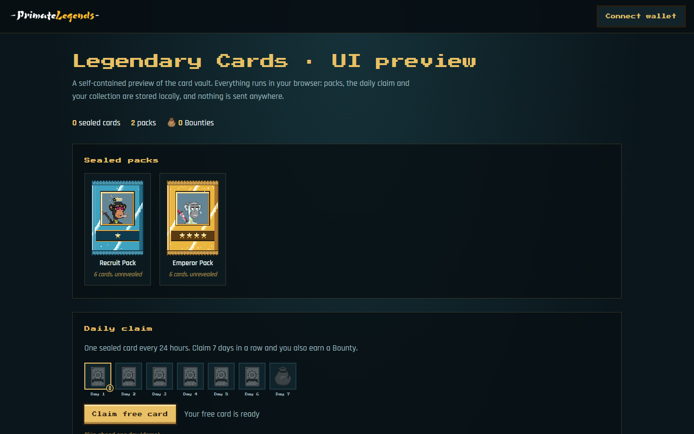

<p align="center">
  
</p>

<h1 align="center">Primate Legends Platform &amp; Apps</h1>

<p align="center">
  Apps, game engine and integrations for Primate Legends, a pixel-art ninja-empire collection of 3,003 warriors on Ethereum.
</p>

<p align="center">
  <a href="https://primatelegends.world">primatelegends.world</a> ·
  <a href="https://x.com/primatelegends">@primatelegends</a> ·
  <a href="docs/architecture.md">Architecture</a> ·
  <a href="docs/card-battles.md">Card Battles</a> ·
  <a href="docs/pre-market.md">Pre-Market</a> ·
  <a href="contracts/">Contracts</a> ·
  <a href="docs/roadmap.md">Roadmap</a>
</p>

<p align="center">
  
</p>

## Apps

| App | What it is | Status |
| --- | --- | --- |
| [Legendary Cards preview](apps/legendary-cards-preview/) | Browser-only preview of the card vault: sealed packs, daily claims with a 7-day streak, card hints and the collection grid | Preview |
| [Card Battles](apps/card-battles/) | Rules engine for the two-player card game: rounds, Ki, attack token, keywords, Heroes, scoring and Honor | In development |
| [Pre-Market](apps/pre-market/) | Rules for trading sealed cards before they go on-chain: listings, filters, wallet-to-wallet checkout, linked Solana wallets | In development |

## Pre-Market

Players trade sealed Legendary Cards before cards go on-chain, paying each other directly in ETH or
USDC on Solana. Your ETH wallet is your profile; up to 3 Solana wallets can be linked to it. Every
Pre-Market card is pegged 1:1 to the [`LegendaryCards`](contracts/LegendaryCards.sol) ERC-1155 contract
and airdropped to its owner at migration. Details in [docs/pre-market.md](docs/pre-market.md).

## Contracts

| Contract | Purpose |
| --- | --- |
| [`LegendaryCards`](contracts/LegendaryCards.sol) | ERC-1155 sealed cards, 1:1 migration from a Merkle snapshot of the Pre-Market |
| [`PreMarketSettlement`](contracts/PreMarketSettlement.sol) | One-transaction ETH checkout with an immutable fee, keeps nothing |
| [`HonorLedger`](contracts/HonorLedger.sol) | Seasonal Card Battles Honor, claimed with Merkle proofs |

All drafts, not audited, not deployed. They compile with solc 0.8.28 and run in an in-process EVM in `npm test`.

## Primate Legends: Card Battles

The game your Legendary Cards are for. Two players, 40-card decks, one Shrine each.

- **Rounds and Ki.** Both players gain Ki every round and trade turns playing warriors,
  techniques, relics and zones. Up to 3 unspent Ki is saved as Focus Ki.
- **The attack token** switches every round. The attacker sends warriors into lanes, the
  defender blocks, and whatever gets through hits the Shrine.
- **Card types are keywords:** Attack = Quick Blade, Defense = Iron Skin, Evasion = Shadowstep,
  Healing = Mend.
- **Heroes.** Warriors level up when their Hero condition is met.
- **Honor on-chain.** Matches are deterministic and replayed by the server. Each season's
  Honor is committed as a Merkle root to the [`HonorLedger`](contracts/HonorLedger.sol)
  contract, where players claim it.

Full rules in [docs/card-battles.md](docs/card-battles.md).

```js
import { createMatch, apply } from './apps/card-battles/src/engine.js';

let match = createMatch({ seed: 42, decks: [deckA, deckB] });
match = apply(match, { type: 'play', player: 0, handIndex: 0 });
match = apply(match, { type: 'attack', player: 0, attackers: [1] });
```

## Run it

```bash
git clone https://github.com/PrimateLegends/Platform-and-Apps.git
cd Platform-and-Apps
npm start        # http://localhost:8080/apps/legendary-cards-preview/
npm test         # Card Battles rules tests
npm run check    # assets resolve, no secrets or local paths
```

Node 18 or newer. The apps have no dependencies; `npm install` only adds the Solidity compiler and the test EVM used by `npm test`.

## Layout

```
├── apps/
│   ├── legendary-cards-preview/   card vault UI preview (ES modules, no build step)
│   ├── card-battles/              rules engine + tests
│   └── pre-market/                Pre-Market rules: listings, checkout, linked Solana wallets
├── contracts/                     Solidity drafts (LegendaryCards, PreMarketSettlement, HonorLedger) + EVM tests
├── integrations/                  OpenClaw skill, ChatGPT app (planned)
├── docs/                          architecture, Card Battles, Pre-Market, roadmap
└── scripts/                       local server, repository checks, contract compiler
```

## Agents

| Integration | Status |
| --- | --- |
| [OpenClaw skill](integrations/openclaw/): ask your agent about your cards, packs and daily streak | Experimental |
| [ChatGPT app](integrations/chatgpt/): explore clans, lore and your collection from a chat | Planned |
| MCP server for the read-only vault API | Planned |

## On-chain

| Item | Status |
| --- | --- |
| Primate Legends collection (ERC-721, 3,003 tokens) | Planned |
| Sealed Legendary Cards (ERC-1155 airdrops) | Planned |
| Burn 4 cards + 1 Primate for WETH or Ryo Coins | Planned (after mint) |
| Card Battles Honor ([`HonorLedger.sol`](contracts/HonorLedger.sol)) | Draft |
| Legendary Cards on [Phygitals](https://www.phygitals.com/) | Goal |

No contract is deployed yet. Official addresses will only be published in
[`contracts/`](contracts/) and announced on [@primatelegends](https://x.com/primatelegends).

## License

All rights reserved. The code is public so you can read and try it. The artwork, characters
and names belong to Primate Legends. See [LICENSE](LICENSE).

Security issues: see [SECURITY.md](SECURITY.md).
