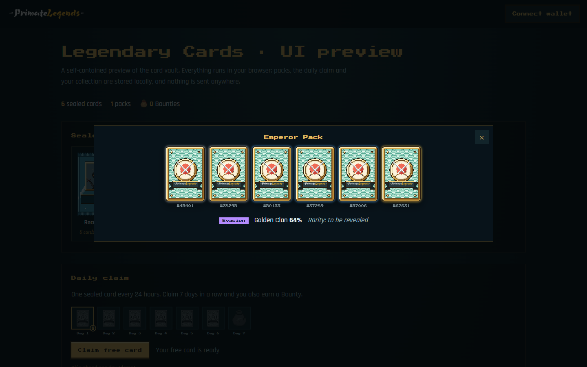
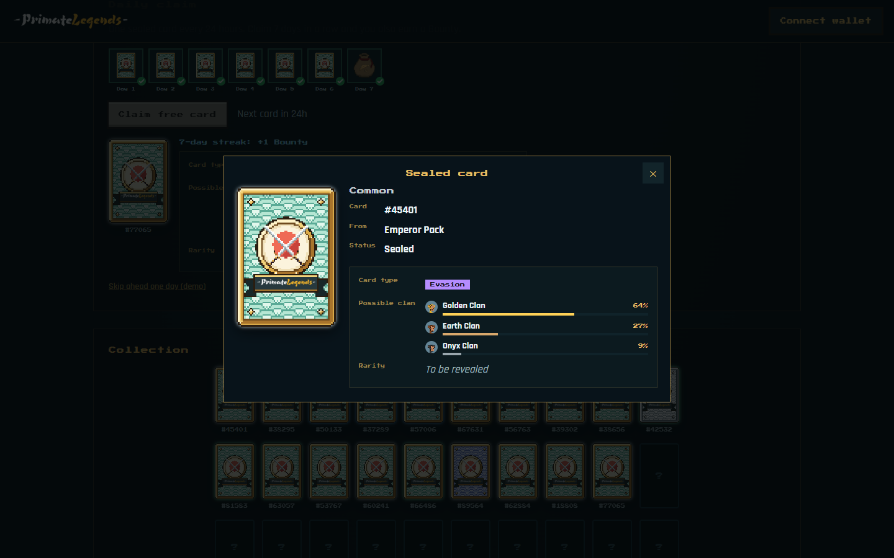

<p align="center">
  
</p>

<p align="center">
  <b>Legendary Cards · UI preview</b><br>
  The card vault of Primate Legends, a pixel-art ninja-empire collection of 3,003 warriors on Ethereum.
</p>

<p align="center">
  <a href="https://primatelegends.world">primatelegends.world</a> ·
  <a href="https://x.com/primatelegends">@primatelegends</a> ·
  <a href="docs/architecture.md">Architecture</a> ·
  <a href="docs/roadmap.md">Roadmap</a>
</p>

<p align="center">
  
</p>

## What this is

A self-contained preview of the Legendary Cards vault that runs entirely in the
browser. Clone it, open it, and try the same flows holders use on
primatelegends.world: rip sealed packs, claim a free card every day, keep a
7-day streak for Bounties and browse your collection.

Nothing here talks to a server. Rolls, the vault and the streak are stored in
`localStorage`, and a "skip a day" button lets you try the streak without
waiting.

<p align="center">
  
  
</p>

## Features

- **Sealed packs.** Ten pack types (odds packs and clan packs), six cards each,
  with guarantees on the higher tiers.
- **Card hints.** Cards stay sealed, but each one shows a card type (Attack,
  Defense, Evasion or Healing) and the clans it most likely belongs to. Rarity
  stays "to be revealed".
- **Random serials.** Every card gets a unique number between #1 and #99999.
- **Daily claim.** One free card every 24 hours. Seven days in a row pays a
  Bounty; missing more than 48 hours resets the streak.
- **Collection.** 40 slots per page: 10 x 4 on desktop, 4 x 10 on phones.
- **Any wallet.** The wallet picker lists every wallet installed in the browser
  through EIP-6963 discovery. The preview only reads the address.

## Run it

```bash
git clone https://github.com/PrimateLegends/website.git
cd website
npm start        # http://localhost:8080
npm run check    # assets resolve, no secrets or local paths
```

Node 18 or newer. No dependencies to install. ES modules, no build step.

## Layout

```
├── index.html
├── src/
│   ├── main.js
│   ├── data/catalog.js        clans, rarities, card types, packs
│   ├── lib/                   random, rolls, local vault
│   ├── components/            card, pack opener, daily claim, collection, hints, wallet, dialog
│   └── styles/app.css
├── public/img/                card backs, packs, clan portraits, items
├── integrations/              OpenClaw skill, ChatGPT app (planned)
├── contracts/                 Solidity sources once deployed
├── docs/                      architecture, roadmap, screenshots
└── scripts/                   local server and repository checks
```

## Agents

| Integration | Status |
| --- | --- |
| [OpenClaw skill](integrations/openclaw/): ask your agent about your cards, packs and daily streak | Experimental |
| [ChatGPT app](integrations/chatgpt/): explore clans, lore and your collection from a chat | Planned |
| MCP server for the read-only vault API | Planned |

## On-chain

| Item | Status |
| --- | --- |
| Primate Legends collection (ERC-721, 3,003 tokens) | Planned |
| Sealed Legendary Cards (ERC-1155 airdrops) | Planned |
| Burn 4 cards + 1 Primate for WETH or Ryo Coins | Planned (after mint) |
| Verified Solidity source in [`contracts/`](contracts/) | Planned |
| Legendary Cards on [Phygitals](https://www.phygitals.com/) | Goal |

No contract is deployed yet. Official addresses will only be published in
[`contracts/`](contracts/) and announced on [@primatelegends](https://x.com/primatelegends).

## License

All rights reserved. The code is public so you can read and try it. The
artwork, characters and names belong to Primate Legends. See [LICENSE](LICENSE).

Security issues: see [SECURITY.md](SECURITY.md).
