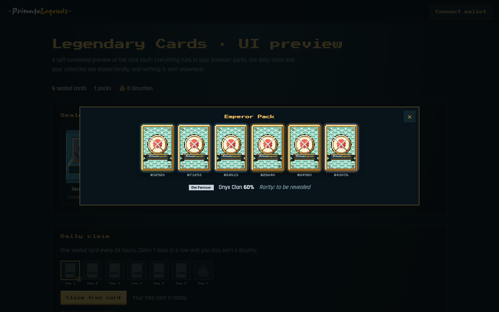
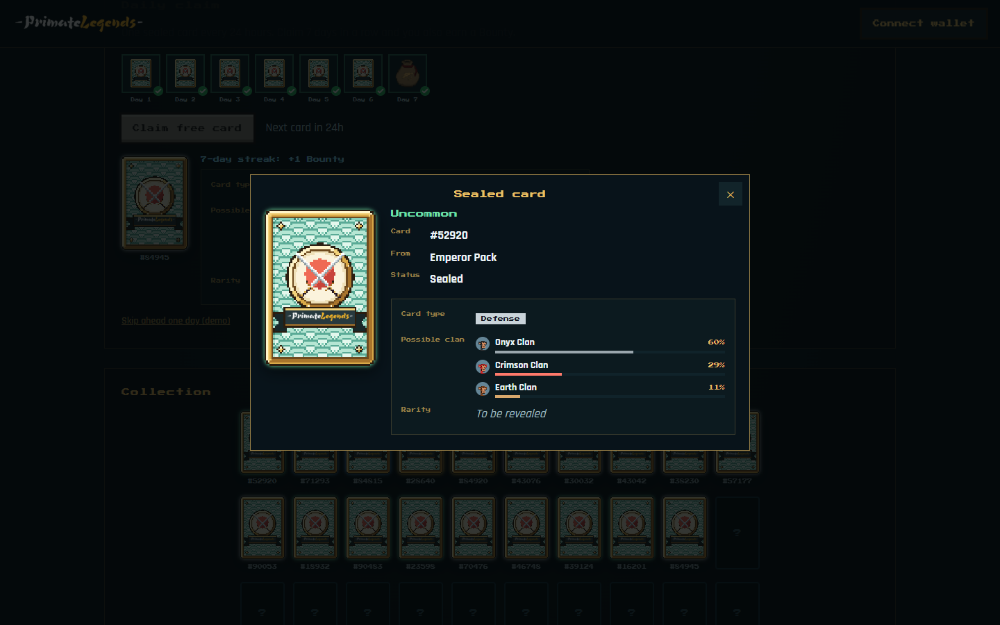

# Legendary Cards · UI preview

A self-contained preview of the card vault that runs entirely in the browser: rip sealed packs,
claim a free card every day, keep a 7-day streak for Bounties and browse your collection.
Nothing talks to a server; the vault lives in `localStorage`.

```bash
npm start   # from the repository root, then open http://localhost:8080/apps/legendary-cards-preview/
```

<p align="center">
  
  
</p>
