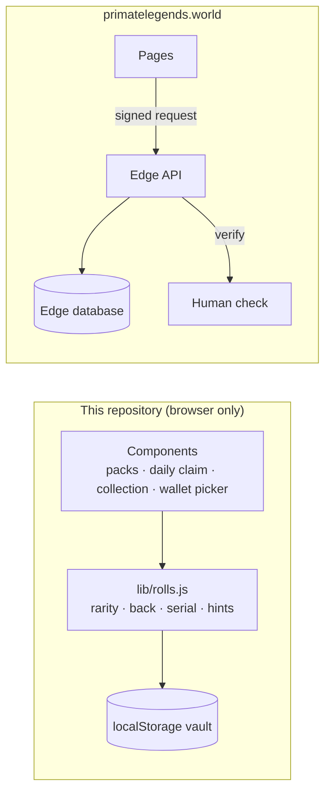

# Architecture

This repository is a **UI preview** of the Legendary Cards vault. It runs
entirely in the browser with no backend, so anyone can clone it and try the
flows. The production site uses the same ideas with the pieces that must not
live in a browser moved to the server.



## Source layout

Legendary Cards preview (`apps/legendary-cards-preview/`):

| Path | What it does |
| --- | --- |
| `src/data/catalog.js` | Clans, rarities, card types, packs and their odds |
| `src/lib/random.js` | CSPRNG helpers and weighted picks |
| `src/lib/rolls.js` | Pack rarities (with guarantees), card backs, random serials, sealed-card hints |
| `src/lib/vault.js` | Local vault: packs, cards, daily claim streak, Bounties |
| `src/components/card.js` | Sealed card with rarity glow and pointer tilt |
| `src/components/pack-opener.js` | Pack shelf and the six-card deal |
| `src/components/daily-claim.js` | 7-day streak tracker, claim button, Bounty on day 7 |
| `src/components/collection.js` | 40-slot grid (10 x 4 desktop, 4 x 10 mobile), pages, card detail |
| `src/components/hints.js` | Card type, possible clan with odds, rarity kept hidden |
| `src/components/wallet.js` | Lists every installed wallet (EIP-6963) and reads the address |

## Rules the preview follows

- **Sealed cards stay sealed.** Hints show a card type and the likely clans;
  rarity is always "to be revealed".
- **Serial numbers are random** in 1..99999 and never repeat.
- **Daily claim:** one card every 24 hours. A streak survives if each claim is
  less than 48 hours after the previous one; every 7th day pays a Bounty.
- **Clan packs** always point at their own clan in the hints.

## What production adds

- Rolls happen on the server, never in the browser.
- Every write is authorised with a free wallet signature (`personal_sign`),
  verified server-side. No transaction, no gas.
- Daily claims require a human check and are rate-limited per network.
- Sealed cards are airdropped later as ERC-1155 tokens.

## Local development

```bash
npm start        # http://localhost:8080/apps/legendary-cards-preview/
npm run check    # assets resolve, no secrets or local paths
```

## Card Battles

The game's rules engine lives in `apps/card-battles/` and is documented in
[card-battles.md](card-battles.md). It is a pure state machine: `apply(state, action)` returns
a new state, and `replay({ seed, decks, actions })` rebuilds any match from scratch. That is
what lets the server verify ranked results before their Honor is committed on-chain.
